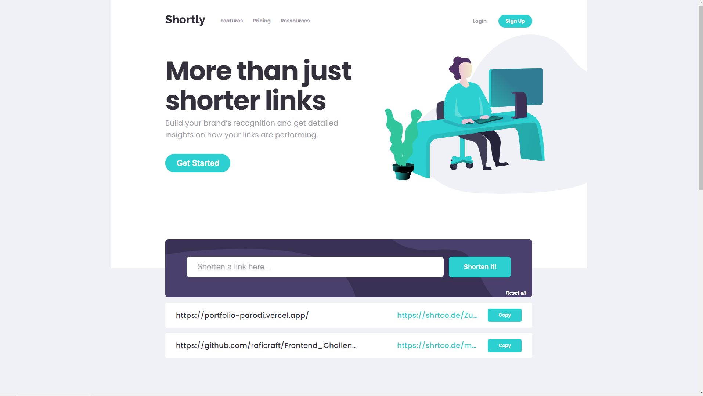

# Frontend Mentor - Shortly URL shortening API Challenge solution

This is a solution to the [Shortly URL shortening API Challenge challenge on Frontend Mentor](https://www.frontendmentor.io/challenges/url-shortening-api-landing-page-2ce3ob-G). Frontend Mentor challenges help you improve your coding skills by building realistic projects. 

## Table of contents

- [Frontend Mentor - Shortly URL shortening API Challenge solution](#frontend-mentor---shortly-url-shortening-api-challenge-solution)
  - [Table of contents](#table-of-contents)
    - [The challenge](#the-challenge)
    - [Screenshot](#screenshot)
    - [Links](#links)
    - [Built with](#built-with)
  - [Author](#author)

### The challenge

Users should be able to:

- View the optimal layout for the site depending on their device's screen size
- Shorten any valid URL
- See a list of their shortened links, even after refreshing the browser
- Copy the shortened link to their clipboard in a single click
- Receive an error message when the `form` is submitted if:
  - The `input` field is empty

### Screenshot

### Links

- Live Site URL: [https://vercel.com/raficraft/frontend-challenge-url-short-level-4](https://your-live-site-url.com)

### Built with

- [React.js](https://fr.reactjs.org/) - React framework
- [Typescript](https://www.typescriptlang.org/) - Typescript
- [Styled Components](https://styled-components.com/) - For styles
- [Jest](https://jestjs.io/fr/) - Testing Tools
- [API](https://shrtco.de/) URL short features
- [React-helmet](https://www.npmjs.com/package/react-helmet) Manage head document
- Multiple SVG component
- CSS custom properties
- Flexbox

## Author

- Portfolio - [Parodi raphaël](https://frontend-challenge-url-short-level-4.vercel.app/)
- Linkedin - [Parodi raphaël](https://www.linkedin.com/in/%F0%9F%9A%80-raphael-parodi-a942ab1b0/)
- Frontend Mentor - [@yourusername](https://www.frontendmentor.io/profile/raficraft)

